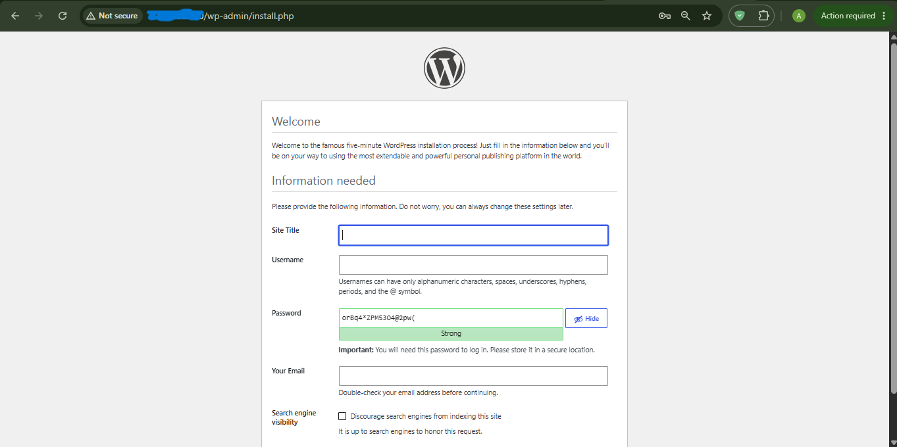
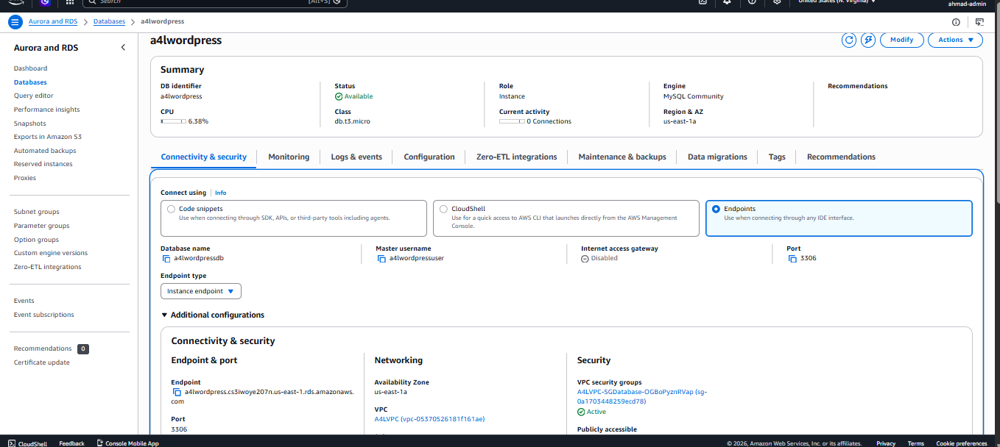
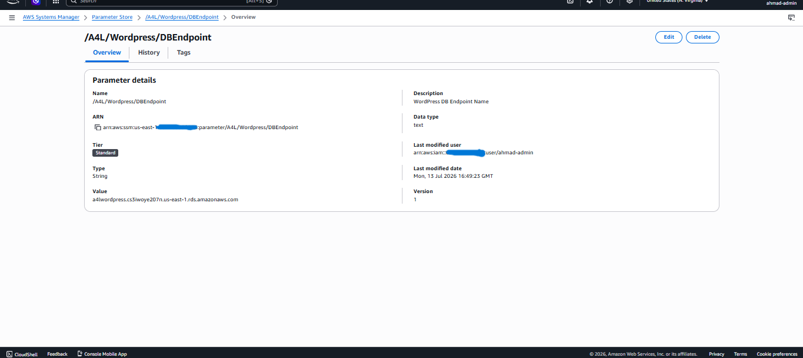
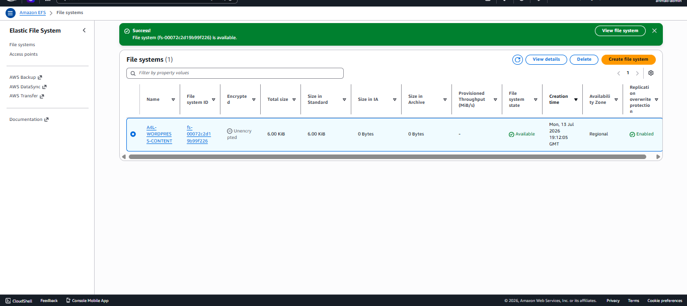
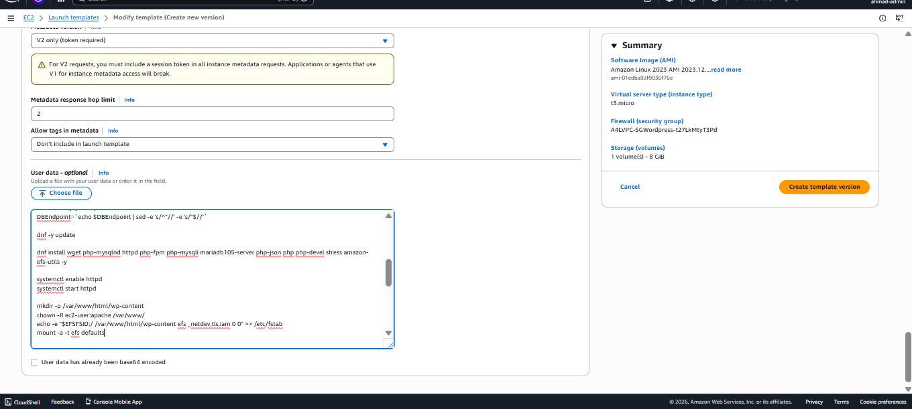
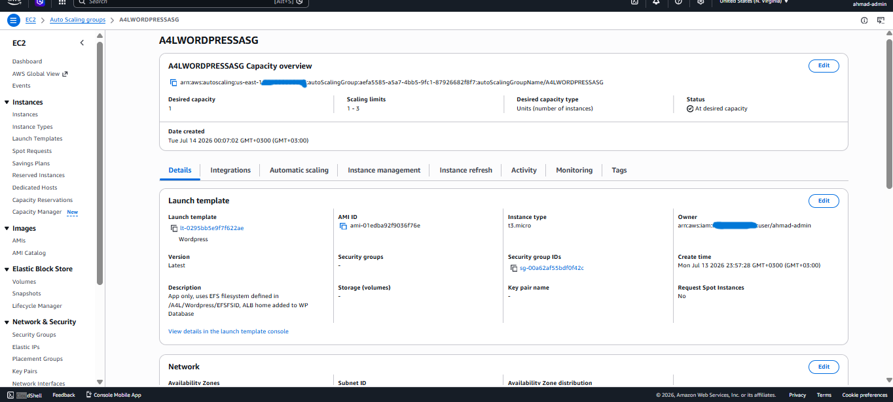
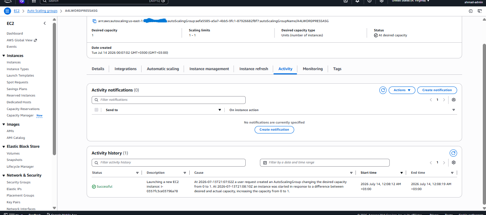
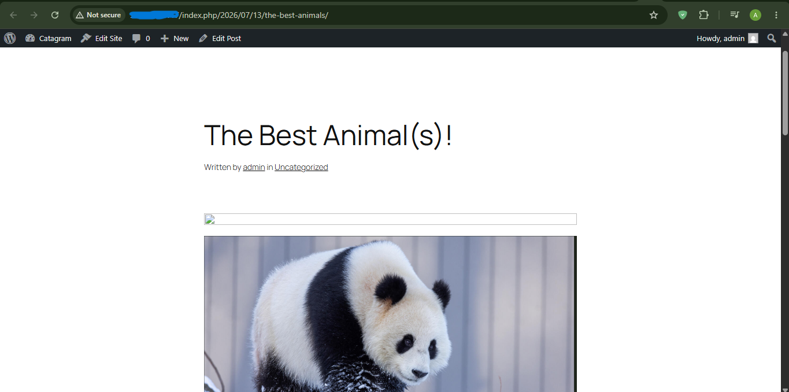

# ☁️ AWS Architecture Migration: Stateful Monolith to Highly Available Decoupled Environment

### 📌 Project Overview
This project demonstrates the architectural evolution of a web application from a fragile, single-server stateful monolith into a highly available, fault-tolerant, and stateless enterprise environment.

The objective was to systematically decouple the database and storage layers, abstract the network routing, and implement automated infrastructure scaling using AWS core services.

### 🛠️ Technology Stack
* **Compute & Scaling:** Amazon EC2, Auto Scaling Groups (ASG), Launch Templates
* **Networking & Traffic Routing:** Virtual Private Cloud (VPC), Application Load Balancer (ALB), NAT Gateways
* **Storage & Databases:** Amazon RDS (MySQL), Amazon Elastic File System (EFS)
* **Configuration Management:** AWS Systems Manager (SSM) Parameter Store
* **OS & Scripting:** Amazon Linux 2023, Bash (User Data automation)

---

### 🏗️ Architecture Evolution

#### Phase 1: The Baseline & Automation
* Deployed a baseline WordPress application on a single EC2 instance.
* Authored a Bash script (User Data) to fully automate the installation of Apache, PHP, and MariaDB, transitioning from manual configuration to Infrastructure as Code (IaC) principles.



#### Phase 2: Database Decoupling (The Control Plane)
* Provisioned an Amazon RDS MySQL instance in a private subnet.
* Utilized AWS Systems Manager (SSM) Parameter Store to dynamically inject the RDS endpoint into the EC2 launch template, eliminating hardcoded database IPs.




#### Phase 3: Storage Decoupling (The Data Plane)
* Created an Amazon EFS network file system to serve as a centralized, highly available storage repository for all EC2 instances.
* Configured NFS mount targets across multiple Availability Zones to ensure local media survived instance termination.




#### Phase 4: High Availability & Elasticity
* Placed the stateless EC2 instances behind an Application Load Balancer (ALB) to distribute incoming traffic and abstract IP resolution.
* Wrapped the compute layer in an Auto Scaling Group (ASG) with automated health checks, ensuring failed instances are instantly terminated and replaced without human intervention.





---

### ⚠️ Real-World Troubleshooting & Engineering Fixes
A major focus of this lab was resolving the friction that occurs when legacy applications are forced into modern distributed architectures. Below are the specific issues diagnosed and resolved during deployment:

#### 1. NFS Mount Permission Denials (EFS)
* **The Issue:** When the EC2 instance mounted the EFS drive, the default Linux root ownership prevented the Apache web server from writing media files to the `/wp-content/` directory, resulting in upload failures.
* **The Fix:** Accessed the instance via Session Manager and explicitly granted ownership and write permissions to the web server group:

```bash
sudo chown -R ec2-user:apache /var/www/html/wp-content
sudo chmod -R 2775 /var/www/html/wp-content
```
### 2. The Hardcoded Database Trap (Breaking the ASG)
The Issue: WordPress natively hardcodes the initial server IP into its database. When the Auto Scaling Group provisioned new instances, the database forcefully redirected traffic to the old, terminated IP address, causing ERR_CONNECTION_TIMED_OUT.

The Fix: Injected PHP override commands directly into the wp-config.php file to force the application to dynamically accept the Load Balancer's DNS name. This fix was applied via Session Manager, allowing access to the admin panel to permanently update the core database URLs to the ALB DNS.

### 3. ALB 502 Bad Gateway Errors
The Issue: After injecting the PHP fix, the Load Balancer threw a 502 Bad Gateway error.

The Diagnosis: Identified hidden formatting characters and "smart quotes" introduced during a copy/paste operation, which corrupted the PHP syntax and crashed the web server service.

The Fix: Terminated the corrupted instance (leveraging the ASG's self-healing capability to automatically provision a fresh replacement) and manually authored the syntax in the configuration file to ensure clean execution.
